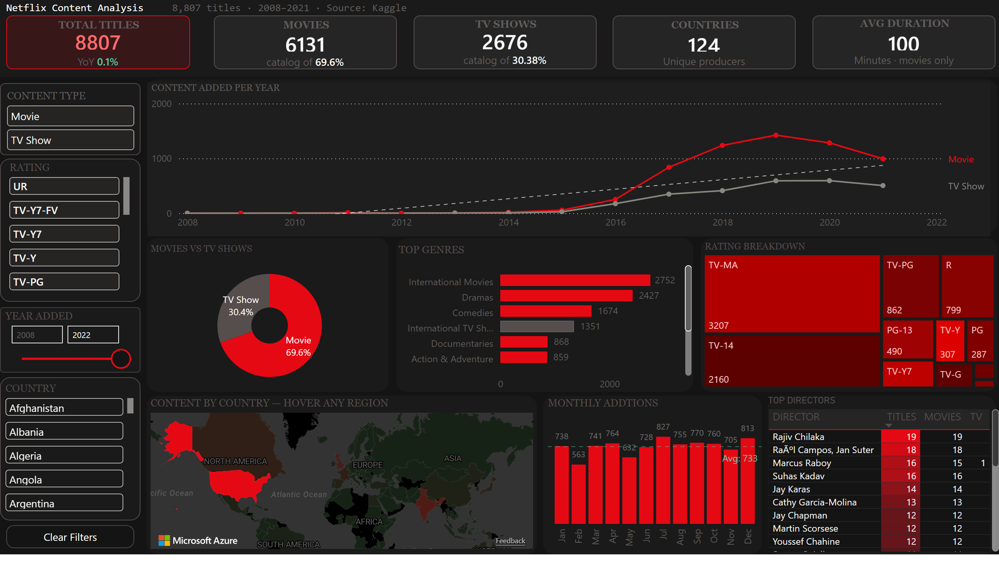
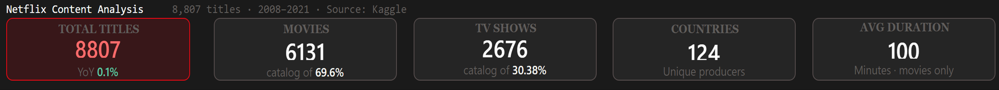
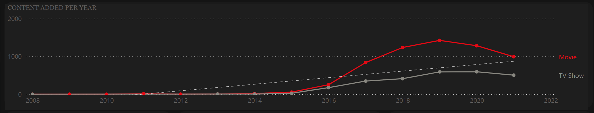
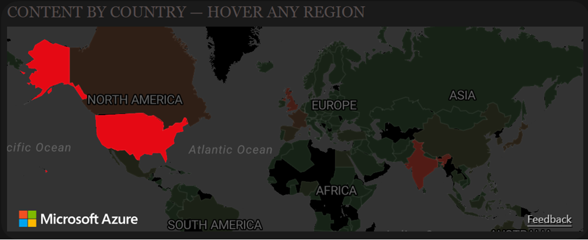
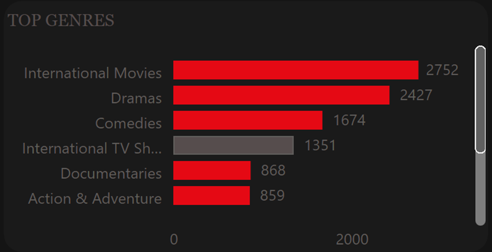

 # Netflix Content Analysis Dashboard

An end-to-end data analytics project analysing **8,807 Netflix titles** (2008–2021) across content type, genre, country, rating, director, and release trends.

**Tools:** Python · MS SQL Server · Power BI  
**Dataset:** [Netflix Movies and TV Shows — Kaggle](https://www.kaggle.com/datasets/shivamb/netflix-shows)  
**Live dashboard:** [View interactive dashboard →](https://app.powerbi.com/view?r=eyJrIjoiMzliODEzNDYtOWVmZi00OWM5LTk1YjUtNTliMWYxOWFjNmY3IiwidCI6IjU0OTJmYzlhLWQ0MTctNGRlMi05NDU0LTY3ZjM4YmZhMWYzNCJ9)

---



---

## Key findings

- **69.6%** of the catalog is Movies — but TV Show growth rate overtook Movies after 2016
- **TV-MA** dominates ratings at **36%** of all titles — the catalog skews heavily toward mature content
- **United States** produces **34%** of all Netflix content; India is the second largest at 9.6%
- **June** is the peak month for new content additions — nearly 3× more titles than January
- Average movie duration has barely shifted in 13 years — consistently around **99 minutes**
- International TV Shows and Dramas are the largest genre categories with 2,400+ titles each

---

## Project structure

```
netflix-content-analysis/
│
├── data/
│   ├── netflix_clean.csv          # Cleaned main table (1 row per title)
│   ├── netflix_genres.csv         # Exploded genres (1 row per title-genre pair)
│   └── netflix_countries.csv      # Exploded countries (1 row per title-country pair)
│
├── python/
│   └── netflix_cleaning.py        # Data cleaning script
│
├── sql/
│   └── netflix_eda_queries.sql    # 10+ EDA queries with window functions
│
├── powerbi/
│   └── netflix-dashboard.pbix     # Power BI dashboard file
│
├── screenshots/
│   └── dashboard_preview.png      # Full dashboard screenshot
│
└── README.md
```

---

## Tools & workflow

```
Raw CSV  →  Python (cleaning)  →  MS SQL (EDA)  →  Power BI (dashboard)
```

### Python — data cleaning

Script: `python/netflix_cleaning.py`

- Parses `date_added` from string to datetime and extracts `year_added`, `month_added`, `month_name`
- Extracts numeric `duration_int` from strings like "99 min" and "2 Seasons"
- Fills null values in `director`, `cast`, `country`, and `rating` columns
- Explodes comma-separated `listed_in` (genres) and `country` columns into normalised tables
- Produces 3 clean CSV files for SQL import and Power BI loading

**Libraries:** `pandas`, `numpy`

### MS SQL — exploratory data analysis

Script: `sql/netflix_eda_queries.sql`

Queries include:

| Query | Technique |
|---|---|
| Content type split (Movies vs TV Shows) | `GROUP BY`, `OVER()` window |
| Yearly content additions trend | `GROUP BY year_added` |
| Top 10 producing countries | `TOP N`, `ORDER BY` |
| Top 15 directors by title count | `GROUP BY director` |
| Rating distribution by type | `PIVOT` / cross-tab |
| Average movie duration by year | `AVG()`, `GROUP BY` |
| Monthly seasonality analysis | `MONTH()`, `GROUP BY` |
| Top genres from exploded table | `JOIN`, `GROUP BY` |
| YoY growth using LAG | `LAG()` window function |
| Director–genre heatmap | `JOIN`, `GROUP BY` |

### Power BI — interactive dashboard

File: `powerbi/netflix-dashboard.pbix`

**Data model:**
- Star schema — `Titles` as fact table, `Genres` and `Countries` as dimension tables
- `DateTable` created in DAX, marked as Date Table for time-intelligence functions
- All relationships: one-to-many, single cross-filter direction
- 16 DAX measures stored in `_Measures` table

**DAX measures include:**
- `Total Titles`, `Movies`, `TV Shows`, `Total Countries`
- `Titles Added`, `Titles LY`, `YoY Growth %`
- `Running Total`, `Titles YTD`
- `Movie %`, `TV Show %`, `Genre Share %`
- `Avg Movie Duration (min)`, `Avg Seasons`
- `Release to Add Gap (yrs)`, `Dynamic Title`

**Dashboard visuals (9 total):**
- 5 KPI cards with YoY growth reference labels
- Line chart — content added per year, dual-series with secondary YoY % axis
- Donut chart — Movies vs TV Shows split
- Filled map (Azure Maps) — content by country with custom tooltip page
- Horizontal bar chart — Top 10 genres, stacked by content type
- Treemap — rating distribution across 9 maturity categories
- Column chart — monthly additions (seasonality), October peak highlighted
- Table — Top 15 directors with inline conditional formatting bars

**Key Power BI features used:**
- Custom tooltip page on the filled map (mini genre breakdown on hover)
- Drill-through to country detail page
- Conditional formatting on directors table (inline bar chart in cells)
- Edit interactions — country slicer exempt from filtering the map
- Analytics pane trend lines and average lines
- 4 cross-filtering slicers: content type, rating, year range, country

---

## How to run

### 1. Python cleaning

```bash
pip install pandas numpy
python python/netflix_cleaning.py
```

This produces `netflix_clean.csv`, `netflix_genres.csv`, and `netflix_countries.csv` in the `data/` folder.

### 2. MS SQL EDA

1. Open SQL Server Management Studio (SSMS)
2. Import the 3 CSV files: right-click database → Tasks → Import Flat File
3. Open `sql/netflix_eda_queries.sql` and run each query

### 3. Power BI dashboard

1. Open `powerbi/netflix-dashboard.pbix` in Power BI Desktop
2. If prompted to refresh data, point the data source to your local `data/` folder
3. All relationships, measures, and formatting are pre-configured

---

## Dashboard screenshots

| Section | Preview |
|---|---|
| Header — KPI cards |  |
| Line chart — yearly trend |  |
| Map — content by country |  |
| Genres bar chart |  |

---

## Dataset

| Field | Description |
|---|---|
| `show_id` | Unique title identifier |
| `type` | Movie or TV Show |
| `title` | Title name |
| `director` | Director(s) — comma separated |
| `cast` | Cast members — comma separated |
| `country` | Producing country(ies) — comma separated |
| `date_added` | Date added to Netflix |
| `release_year` | Original release year |
| `rating` | Content maturity rating |
| `duration` | Duration in minutes (Movies) or seasons (TV Shows) |
| `listed_in` | Genre(s) — comma separated |
| `description` | Short description |

**Source:** [Shivam Bansal on Kaggle](https://www.kaggle.com/datasets/shivamb/netflix-shows)  
**Rows:** 8,807 titles  
**Period:** 2008–2021

---

## Skills demonstrated

`Python` · `Pandas` · `Data Cleaning` · `MS SQL Server` · `Window Functions` · `Power BI` · `DAX` · `Data Modelling` · `Data Visualisation` · `Exploratory Data Analysis` · `Dashboard Design` · `Storytelling with Data`

---

## Author

**Ravi Parmar**  
[LinkedIn](https://www.linkedin.com/in/ravi-parmar-25836636) · [GitHub](https://github.com/RaviData007) · [Portfolio](https://yourportfolio.com)

---

*Dataset is publicly available on Kaggle. This project is for portfolio and educational purposes.*
